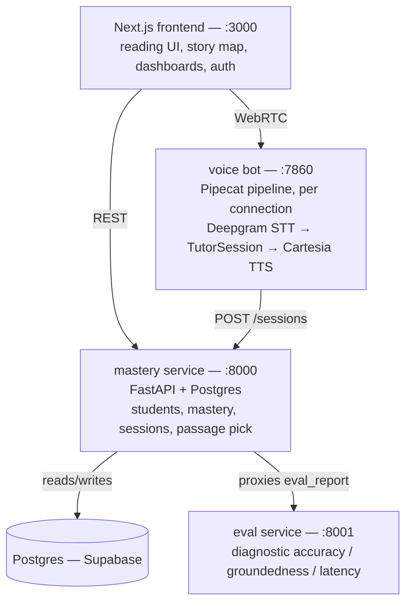

# ReadCoach

A live, voice-interactive AI reading tutor for grades 1-3, built for the Nerdy AI Hackathon.

A child reads a passage out loud into an open mic. The tutor listens in real time,
highlights each word as it's recognized, catches stumbles as they happen, teaches
every real miscue in a warm review pass once the passage is done, asks comprehension
questions out loud and grades the spoken answers, then picks what that child reads
next based on an actual per-skill mastery model — not a script, a live conversation.

## What makes this different

Most reading-practice apps are record-then-analyze: a child reads, a batch process
scores it afterward. ReadCoach is a genuine **live** voice loop — STT, tutoring
logic, and TTS running in the same real-time pipeline a phone call would use, with
a live word-by-word alignment engine doing the hardest part (telling a real
stumble from a self-correction from just being slow) as the words arrive, not
after the fact.

## Architecture

Four independently-run services, deliberately not merged into one process —
a real-time voice/WebRTC bot, two REST APIs, and a web server are genuinely
different kinds of things:



**The live voice pipeline, per connection:**

```
mic audio → Deepgram streaming STT (word-level timestamps + confidence)
          → TutorProcessor (bridges STT frames to the tutor state machine)
              → live word alignment (custom DP, not the LLM) tags each
                word as correct / substitution / omission / self-correction
              → Claude Haiku: fast-tier spoken hints during the end-of-passage
                review pass
              → Claude Sonnet: comprehension question generation, grading,
                session recap
          → Cartesia TTS → speaker
```

Every session is genuinely isolated — a session id minted client-side flows
through the whole connection, so the bot process can run several real
concurrent voice sessions without one child's chosen story or mastery data
leaking into another's (see **Engineering rigor** below).

## Technology stack

| Layer | Technology | Why |
|---|---|---|
| Voice orchestration | [Pipecat](https://github.com/pipecat-ai/pipecat) 1.8.1 | Purpose-built for low-latency streaming STT→LLM→TTS pipelines instead of hand-rolling WebRTC plumbing |
| Transport | Daily / SmallWebRTC | Pipecat's own transports; SmallWebRTC for local dev, Daily for hosted rooms |
| Speech-to-text | Deepgram nova-3 | Low-latency streaming transcription with word-level timestamps, needed for live highlighting and miscue timing |
| LLM | Claude Haiku 4.5 (fast tier) + Claude Sonnet 4.5 (strong tier) | Haiku for in-the-moment hints and turn-completion judging; Sonnet for question generation, grading, and session recaps — split by latency budget, not habit |
| Text-to-speech | Cartesia Sonic | Chosen specifically for low time-to-first-byte, which matters more than voice polish for a conversation that has to feel live |
| Alignment engine | Custom Wagner-Fischer edit-distance DP, pure stdlib | Fully owned, no external dependency for the one algorithm the whole diagnostic signal depends on |
| Backend services | FastAPI + Postgres (Supabase) | `mastery` (schema, mastery model, passage selection) and `eval` (benchmark harness) as separate stateless services |
| Frontend | Next.js 16 / React 19 / Tailwind CSS v4 / TypeScript | |
| Auth | NextAuth.js v5 (Credentials + bcrypt) | Real per-family accounts, not a shared demo profile |
| Charts | D3 v7 | Fluency trend and skill-mastery visualizations |

## Unique features

- **Live, not batch.** The tutor listens and responds while the child is still
  reading, not after uploading a recording.
- **Real-time miscue detection with skill attribution.** Every stumble is
  classified (substitution / omission / insertion / self-correction) and
  mapped to a specific phonics/decoding skill via a deterministic DP
  alignment engine — no LLM in the loop for this, so it's fast and
  reproducible.
- **A warm, single-pass review instead of interrupting mid-sentence.** Early
  iterations spoke a hint the instant a stumble happened; real testing showed
  that read as constant interruption. Every real miscue is now taught in one
  pass after the whole passage is read, before comprehension starts.
- **LLM-gated answer completion.** Distinguishing "the child is done
  answering" from "the child is just pausing to think" mid-answer is
  genuinely ambiguous from silence alone. A fast Claude Haiku call judges
  semantic completeness on each fragment rather than guessing from a fixed
  timeout, with a hard cap so a genuinely stuck answer still gets graded.
- **A real per-skill mastery model**, not a single score: an EMA blend
  (`new = 0.7·old + 0.3·session_score`) per skill across an 18-skill
  phonics/vocabulary/comprehension taxonomy, with partial credit propagated
  to prerequisite-linked skills at half strength — doing well on a
  foundational skill quietly nudges what it unlocks, without claiming a
  child practiced something they didn't.
- **Adaptive passage selection** picks the next story by walking the skill
  taxonomy's own topological order for the weakest, most foundational
  still-weak skill with an available passage — foundations block everything
  built on them, so they're targeted first.
- **A self-correcting evaluation harness.** `backend/eval/` runs synthetic
  sessions with known injected errors through the real pipeline and scores
  diagnostic accuracy, question groundedness (LLM-judged), and latency — see
  **Metrics** below. Running it for real, not just reading an old report,
  surfaced and fixed three real bugs in the harness itself: an untested
  pipeline stage, a dashboard-facing latency statistic that was quietly
  measuring the wrong thing, and — found by a later audit that simply re-ran
  the identical benchmark multiple times — the two LLM-judged metrics and
  hint-generation P95 latency being reported as bare single-run numbers
  despite real, measured run-to-run variance from live Claude calls (skill-
  tagging accuracy read 66.7%, 73.3%, and 100% across three identical runs).
  Fixed by re-running each of those specific metrics 2-3 times and reporting
  a mean plus the observed range, not by chasing a single lucky number.

### Engineering rigor

A concurrency audit (not an assumption) found and fixed three genuine races,
each proven fixed with a real test, not just reasoned about:

- **Passage/student selection race** — two browser tabs starting sessions close
  together could steal each other's chosen story or student. Fixed by keying
  the bot's pending-choice state on a client-minted session id instead of a
  shared global.
- **Event-loop-blocking alignment** — the synchronous word-alignment DP ran
  in-line on the bot's one shared event loop, briefly stalling every other
  concurrent session on every recognized word. Moved to a thread via
  `asyncio.to_thread`.
- **Mastery lost-update race** — two sessions for the same student landing
  close together could both read the same stale skill weight and the second
  write would silently clobber the first. Replaced the read-then-write with
  a single atomic SQL upsert; verified by firing 8 genuinely concurrent
  identical sessions and confirming the final weight matches 8 sequential
  applications of the EMA formula to six decimal places.

An admission cap (`MAX_CONCURRENT_SESSIONS`, default 6) now turns away a new
voice session before any STT/LLM/TTS service is constructed once the bot
process is at capacity, rather than letting every active session degrade
together against shared provider rate limits.

## Metrics

Real numbers from the last full run of `backend/eval/run_benchmark.py`
(regenerate anytime with `python3 run_benchmark.py` from `backend/eval/`;
also served live at `GET /admin/eval_report` and summarized on the
engineering dashboard). The skill taxonomy grew from 18 to 27 skills (9 new
vocabulary/comprehension skills: word_categories, synonyms_and_antonyms,
multiple_meaning_words, prefixes_and_suffixes_meaning, figurative_language,
character_traits_and_analysis, compare_and_contrast, predicting_outcomes,
authors_purpose) — the numbers below are a fresh run against that current
27-skill scope, not the frozen pre-expansion numbers from an earlier report.

**A note on methodology before the numbers**: an audit re-ran this exact
benchmark against unchanged code multiple times and found that
skill-tagging accuracy, question groundedness, and hint-generation P95
latency all have real, measured run-to-run variance — they depend on live
Claude calls, which are not perfectly deterministic (skill-tagging accuracy
alone read 66.7%, 73.3%, and 100% across three identical runs). Reporting
any one of those runs as *the* number would have been misleading. Those
three metrics are now each computed from multiple independent trials
(`groundedness_eval.py`: 3 trials; `latency_eval.py`: 2, since a full
latency trial is the most expensive real-API-call unit in the harness) and
reported below as **mean (observed range across N runs)**. Diagnostic
accuracy makes no API calls and is fully deterministic, so it is still a
single run — there is nothing to average.

**Diagnostic accuracy** — 105 synthetic sessions with a known, deliberately
injected error each, run through the real alignment engine (no API calls,
deterministic single run). Still phonics-only by design: `alignment.align()`
classifies word-level miscues, which has no equivalent for the 9 new
vocabulary/comprehension skills (see `backend/eval/benchmark_cases.py`'s
scope note) — those are covered by the new skill-gap-identification check
below instead.

**90.5%** overall (95/105) — unchanged from the pre-expansion run, since none
of the 9 new skills touch this code path.

| Category | Accuracy |
|---|---|
| short_vowels, closed_syllables, silent_e, vowel_teams, r_controlled_vowels, diphthongs, compound_words, multisyllabic_decoding, miscue_type | 100% |
| consonant_blends | 90.0% (9/10) |
| consonant_digraphs | 75.0% (6/8) |
| open_syllables | 66.7% (6/9) |
| inflectional_endings | 60.0% (6/10) |

Two categories were genuinely weak in an earlier pass — multisyllabic_decoding
at 33.3% and compound_words at 66.7% — and both are fixed now: long words
("wonderful", "dinosaur") were getting claimed by an incidental r-controlled
or digraph substring before their real length was ever considered, and the
compound-word dictionary was simply missing common grade-1-3 words like
"popcorn"/"football". The two categories still below 100% are left visible
on purpose, not fixed by relaxing the benchmark: **open_syllables** (tiger,
hero, apron) needs a real syllable-boundary model to resolve without
regressing r_controlled_vowels, and **inflectional_endings** is a genuine,
still-open disagreement between two reasonable design philosophies (does
"jumps" belong to its stem's own decoding pattern, or to the suffix a
curriculum unit would actually be teaching with it) — investigated properly,
not fixed by an arbitrary special case; see `backend/eval/benchmark_cases.py`'s
own docstring for the full reasoning on both.

**Question groundedness** — real Claude-generated comprehension questions,
checked by a separate Claude LLM-judge call for whether each is actually
answerable from the passage text. Sample: **17 passages** (51 questions per
trial), one real passage per new skill from `content/passages/`, run **3
independent trials** (real generation + real judging every time):

**90.2% (range: 90.2–90.2% across 3 runs)** — all three trials happened to
land on the same 46/51 questions grounded this time (groundedness is
noisier in general, per the methodology note above, but this particular
sample landed stable). The 5 ungrounded questions found in the most recent
trial all asked a child to infer a character's/author's unstated internal
motivation or an unstated causal mechanism ("why do you think...", "why did
the ball go over the fence...") from a passage that never states the
reason — a real and specific failure mode, not a vague miss. Full list in
`backend/eval/reports/eval_report.json`'s
`question_groundedness_detail.ungrounded_examples`.

**Skill-gap identification** — for each of the 15 vocabulary/comprehension
skills (all vocabulary + comprehension categories; phonics passages are
excluded as not applicable, see `backend/eval/groundedness_eval.py`'s
docstring for why), did at least one of the 3 real generated questions for
that passage get tagged with the passage's own designed `primary_skill`?

**73.3% (range: 66.7–80.0% across 3 runs)** — most recent trial: 10/15
passages. The specific 5 passages that miss their designed tag vary
somewhat trial to trial (real model non-determinism, not a fixed bug), but
the same handful of vocabulary skills keep recurring across trials:
`vocabulary_in_context`, `word_categories`, `prefixes_and_suffixes_meaning`,
`figurative_language`, and `predicting_outcomes` — every generated question
for those passages still lands on a generic comprehension tag
(literal_comprehension/inferential_comprehension/cause_and_effect/etc.)
instead of the passage's own vocabulary skill. So this isn't a
missing-capability bug (the skill is available to pick), it's a model
behavior issue: Claude just doesn't reach for the specific vocabulary tag
as often as the generic comprehension ones. Flagged to `tutor-logic-engineer`
as a prompting problem, not fixed here (`backend/eval` measures the
pipeline, it doesn't tune it) — see `backend/eval/reports/eval_report.json`'s
`question_groundedness_detail.skill_tagging_misses` for the most recent
trial's full list.

**Latency** — real Claude API calls, timed end-to-end through the real
`TutorSession` pipeline code, **2 independent trials** (10 synthetic
sessions each, 20 total):

| Stage | P50 (mean, range) | P95 (mean, range) | n |
|---|---|---|---|
| hint generation | 1148ms (1117–1179ms) | **15445ms (11183–19707ms)** | 20 |
| question generation | 2154ms (2122–2185ms) | 2705ms (2643–2766ms) | 20 |
| answer grading | 1836ms (1804–1869ms) | 2340ms (2251–2428ms) | 80 (includes the one-retry-on-wrong-answer path) |
| **pooled per-call LLM** | **1831ms (1787–1874ms)** | **2659ms (2412–2906ms)** | 120 |

Hint-generation P95 is the headline example of why this fix mattered: one
trial's P95 was 11183ms, the other's was 19707ms — the same real spread an
earlier audit of this exact code path measured (11.6s–19.7s). A single-run
report would have shown whichever of those two numbers happened to run
last and presented it as precise; reporting mean-plus-range instead makes
that swing visible instead of hiding it.

The pooled per-call figure — not a whole session's calls summed back to
back with none of a real session's own reading/thinking/speaking pauses
between them — is what a child actually waits for at any one moment, and is
the number the engineering dashboard uses as its own real fallback when a
given stage doesn't yet have enough live production samples of its own
(the dashboard reads the mean of this figure, a single float, for backward
compatibility with its existing numeric contract; the full range lives in
`eval_report.json`'s `latency_percentiles_detail`).

## Repo layout

```
backend/
  voice/    # Pipecat/Daily/Deepgram/Cartesia real-time voice pipeline
  tutor/    # word-alignment/miscue classification + tutoring state machine
  mastery/  # Postgres schema, mastery update rule, passage selection
  eval/     # automated evaluation benchmark
frontend/   # Next.js reading UI, story map, dashboards, auth
content/    # skill taxonomy (27 skills) + leveled passage library (38 passages)
contracts/  # interface specs every module is built against
docs/       # BUILD_LOG.md — a running, honest account of what was built, broken, and fixed
```

## Running it locally

Four separate processes. `./dev.sh` starts all four together and stops them
together on Ctrl+C:

```bash
./dev.sh
```

Then open `http://localhost:3000`. Each service's own output prints to the
same terminal, interleaved rather than prefixed, so startup errors show up
immediately instead of sitting in a buffer.

## Setup

Required accounts/API keys, set as environment variables (see each service's
own `.env.example`):

- Daily (WebRTC transport) — https://daily.co
- Deepgram (streaming STT) — https://deepgram.com
- Anthropic (Claude) — https://console.anthropic.com
- Cartesia (TTS) — https://cartesia.ai
- Supabase (Postgres) — https://supabase.com

## How this was built

Built with specialized subagents, each owning one directory above, working
against shared interface contracts (`contracts/`) agreed before any code was
written — passage schema, DB schema, the voice event stream, and the
frontend/backend REST surface. `docs/BUILD_LOG.md` is a running, plain-prose
account of the actual build: what was built, what broke, what was found and
fixed along the way, kept as a real record rather than a polished-after-the-
fact summary.
