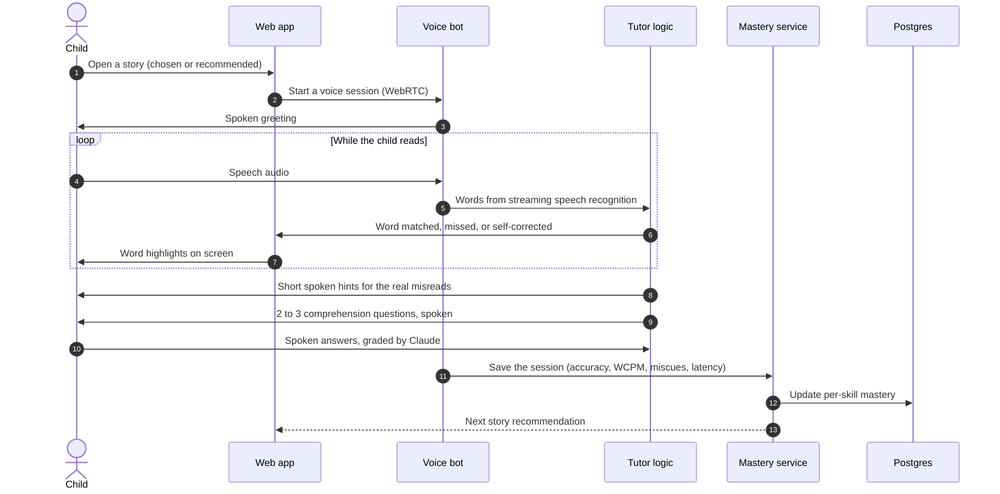
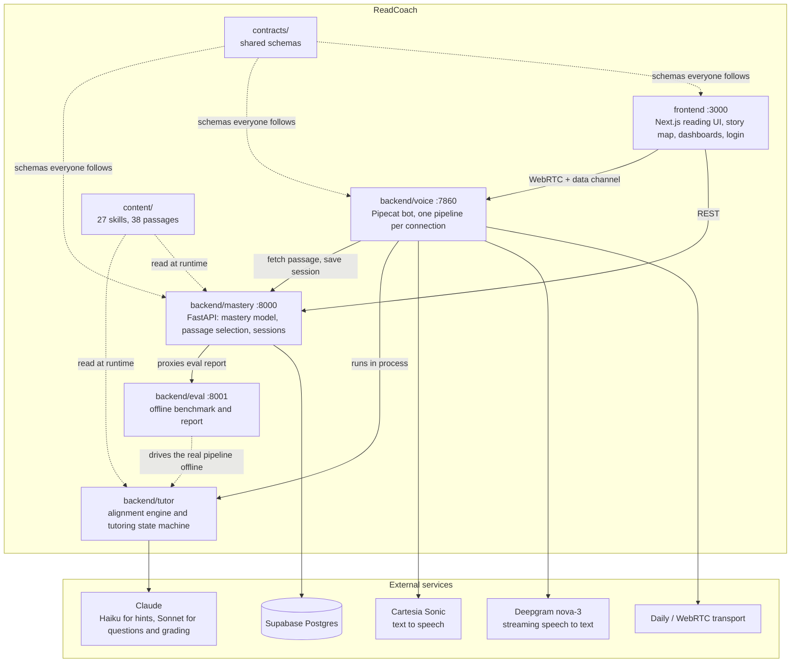
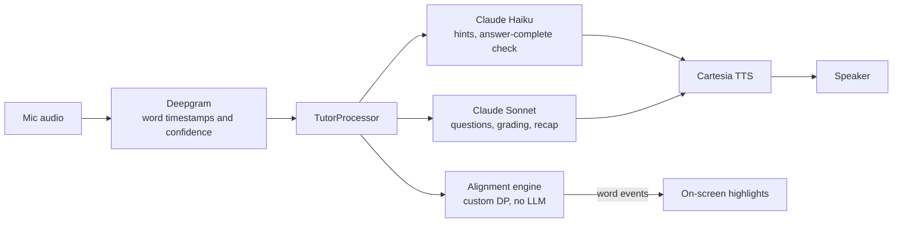

# ReadCoach

**A live voice AI reading tutor for grades 1 to 3.** Built for the Nerdy AI Hackathon.

A child reads a story out loud. ReadCoach listens in real time, lights up each word as it is read, catches misreads, coaches the tricky words, asks comprehension questions out loud, and then picks the next story based on what that child actually needs.

> It is a conversation, not a quiz. There is no upload button and no batch scoring step.

**Contents:** [Why](#why-this-exists) · [How a session works](#how-a-session-works) · [Architecture](#architecture) · [Key features](#key-features) · [Components and the why behind them](#components-and-the-why-behind-them) · [Design decisions](#design-decisions) · [Evaluation](#evaluation) · [Known limits](#known-limits) · [Run it](#run-it-locally) · [Repo layout](#repo-layout)

---

## Why this exists

A child learning to read needs someone to listen. Most reading apps record the child, score the recording later, and show a number. That misses the moments that matter: the word they got stuck on, the fix they made by themselves, the pause where they were thinking.

ReadCoach tries to be that listener. It works while the child is still reading, it knows which skill each mistake belongs to, and it remembers what each child is weak at so the next story fits.

---

## How a session works



In plain words:

1. The child picks a story or takes the recommended one.
2. They read aloud. Every recognized word is highlighted on screen as it arrives.
3. A word-by-word alignment engine compares what was said to the real text and labels each word: correct, substituted, skipped, added, or self-corrected.
4. When the passage ends, the coach gives a short spoken hint for each real miscue.
5. The coach asks comprehension questions out loud and grades the spoken answers.
6. The session is saved, the child's per-skill mastery is updated, and the next story is chosen from the weakest skill.
7. Parents see progress on a dashboard. Engineers see latency and evaluation results.

---

## Architecture

Four services run side by side. They are separate on purpose: a web server, two REST APIs, and a real-time voice bot are different kinds of programs.



Solid lines are live requests. Dotted lines are read at startup, offline, or as a shared agreement.

**The voice pipeline, per connection:**



---

## Key features

| Feature | How it works | Why it matters |
|---|---|---|
| **Live voice tutoring** | Streaming speech to text, tutoring logic, and text to speech run in one real-time pipeline. | The child gets a conversation, not a recording that is scored later. |
| **Word-by-word highlighting** | Each recognized word is sent over a WebRTC data channel and highlighted the moment it lands. | Children see their progress as they read. |
| **Miscue detection with skill tags** | A custom edit-distance alignment (no LLM) labels each word and maps each miscue to a phonics skill. | Fast, repeatable, and it tells the tutor what to teach. |
| **Self-correction detection** | A near-miss followed right away by the correct word is folded into one self-correction instead of an error. | Fixing your own mistake is a good sign and should not be penalized. |
| **Spoken hints** | After the passage, Claude Haiku gives a short spoken hint for each real miscue. | One warm review pass instead of interrupting every sentence. |
| **Comprehension questions** | Claude Sonnet writes 2 to 3 questions grounded in the passage text and grades the spoken answers. | Checks understanding, not only decoding. |
| **Smart answer timing** | A fast Claude call decides if a child has finished answering or is still thinking. | A fixed silence timeout cuts thinking children off. |
| **Per-skill mastery model** | Each of 27 skills keeps its own weight, updated after each session. | One score would hide what a child is actually weak at. |
| **Adaptive next story** | The next story targets the weakest, most foundational skill that has a passage. | Foundations block everything built on them. |
| **Story map** | Skills are shown as three journeys: phonics, vocabulary, comprehension. Progress is real mastery. | Motivation without fake points or streaks. |
| **Parent dashboard** | Fluency trend, skill mastery bars, and a plain-language recap. | Parents can see what changed. |
| **Engineering dashboard** | Per-stage latency and evaluation scores. | Measures what it builds. |
| **Offline evaluation harness** | Synthetic sessions with known injected errors run through the real pipeline. | Regressions show up as numbers. |
| **Real accounts** | NextAuth login with one profile per family. | Children's progress stays separate. |

---

## Components and the why behind them

### `backend/voice`: the real-time voice bot
Built on [Pipecat](https://github.com/pipecat-ai/pipecat) with Deepgram for speech to text, Cartesia for text to speech, and WebRTC for transport.
**Why:** hand-rolling low-latency audio plumbing would have used most of the build time. Pipecat handles turn-taking and streaming so the time went into tutoring logic. Cartesia was chosen for a fast first audio byte, because a conversation has to feel live.
It also caps concurrent sessions (`MAX_CONCURRENT_SESSIONS`, default 6) so one busy moment does not slow everyone down.

### `backend/tutor`: alignment and tutoring logic
`alignment.py` is a small edit-distance algorithm (Wagner-Fischer) that lines up the spoken words against the passage. `tutor_processor.py` and the state machine turn that into events, hints, and questions.
**Why:** the most important signal in the whole product is "did the child stumble, and on what". Doing that without an LLM makes it fast, free per word, and easy to test. Claude is used only where language skill is needed: hints, questions, grading, and recaps.

### Two Claude tiers
| Tier | Model | Used for |
|---|---|---|
| Fast | Claude Haiku 4.5 | Hints and the "is the answer finished" check |
| Strong | Claude Sonnet 4.5 | Question writing, grading, session recaps |

**Why:** split by how long a child can wait, not by habit.

### `backend/mastery`: the memory
A FastAPI service on Postgres. It stores students, sessions, and per-skill mastery, and it picks the next passage.
- **Mastery update:** `new = 0.7 x old + 0.3 x session_score` for each skill, with half-strength partial credit passed to prerequisite-linked skills.
- **Passage choice:** walks the skill order and picks the weakest, most foundational skill that has a passage. Ties break by a fixed foundational order, so the choice is deterministic.

**Why:** a single score cannot say why a child struggles. A per-skill weight can, and it makes the next story a real decision.

### `frontend`: what the child and parent see
Next.js 16, React 19, Tailwind 4, TypeScript, D3 for charts, NextAuth for login. Screens: home, reading, story map, parent dashboard, engineering dashboard.
**Why:** the interface is bright and simple for children, and calm for adults. Incoming events are checked against a schema so one bad message cannot crash a session.

### `backend/eval`: measuring the pipeline
Synthetic sessions with known injected errors run through the real code. It reports diagnostic accuracy, question groundedness, and latency percentiles.
**Why:** without numbers, "it works" is just a feeling. See [Evaluation](#evaluation) for what these numbers do and do not show.

### `content` and `contracts`
`content/` holds the skill taxonomy (27 skills) and 38 leveled passages. `contracts/` holds the shared interface specs (API, database, passage schema, voice events) that every module was built against.
**Why:** agreeing on the interfaces first let the modules be built in parallel without drifting apart.

---

## Design decisions

- **Live, not batch.** The value is in reacting while the child reads.
- **Hints after the passage, not mid-sentence.** An early version spoke a hint the moment a stumble happened. Real testing showed it felt like constant interruption. Now every real miscue is taught in one pass after the passage.
- **Alignment without an LLM.** Deterministic, fast, and testable. The LLM is kept for language tasks.
- **No fake points, streaks, or leaderboards.** There is one child and one tutor, so a leaderboard has nobody on it. Celebrations come from real mastery.
- **Separate services.** A voice bot, two APIs, and a web server have different needs, so they run as different processes.
- **Honest numbers.** Metrics that depend on live Claude calls are reported as a mean with a range across several runs, not as one lucky result.

### Engineering rigor
A concurrency audit found and fixed three real races, each proven fixed with a test:
- **Choice race.** Two browser tabs could steal each other's chosen story. The bot now keys pending choices by a client-made session id.
- **Blocked event loop.** Alignment ran on the shared loop and stalled other sessions. It now runs in a thread.
- **Lost mastery update.** Two sessions for one student could overwrite each other. It is now one atomic SQL upsert, checked with 8 concurrent sessions.

---

## Evaluation

Run with `python3 run_benchmark.py` from `backend/eval/`. Full detail is in [docs/EVALUATION.md](docs/EVALUATION.md).

| Check | Result | What it covers |
|---|---|---|
| Diagnostic accuracy | **90.5%** (95 of 105) | Alignment engine on synthetic sessions with one injected error each. Phonics skills only. |
| Question groundedness | **90.2%** | Are Claude's questions answerable from the passage? Judged by a second Claude call, 3 trials. |
| Skill-gap identification | **73.3%** (range 66.7 to 80.0) | Does a generated question carry the passage's own vocabulary or comprehension skill tag? |
| Per-call LLM latency | **P50 1.8 s, P95 2.7 s** | Pooled hint, question, and grading calls, 2 trials. |

**Read these carefully.** These are synthetic sessions. They test the pipeline, not real children's speech. The LLM-judged numbers vary from run to run, which is why they are reported with a range.

---

## Known limits

Stated plainly so nobody has to guess:

- **Not tested with real children.** Streaming speech recognition is known to be less accurate for young voices. The next step is testing with real learners.
- **Small content library.** 38 passages across 27 skills, so most skills have one or two. Adaptive selection over a small library is limited.
- **Synthetic evaluation.** See above.
- **Self-correction detection is narrow.** It catches a near-miss followed directly by the correct word. A restart or repeated phrase is not counted.
- **Hints come after the passage.** This is a deliberate choice, but mid-read hints are not built.
- **Demo account history.** The demo account has history from earlier testing, so its dashboards look fuller than a brand-new account's.

---

## Run it locally

### You need
- Python 3.12 and Node 20 or newer
- API keys: [Daily](https://daily.co), [Deepgram](https://deepgram.com), [Anthropic](https://console.anthropic.com), [Cartesia](https://cartesia.ai)
- A Postgres database ([Supabase](https://supabase.com) works). The mastery service falls back to SQLite if `DATABASE_URL` is unset, but login needs Postgres.

### Setup
```bash
# 1. Python services (repeat for backend/voice, backend/mastery, backend/eval)
cd backend/voice
python3 -m venv .venv && source .venv/bin/activate
pip install -r requirements.txt
cp .env.example .env        # then fill in the keys

# 2. Database (Postgres)
psql "$DATABASE_URL" -f contracts/db_schema.sql
psql "$DATABASE_URL" -f frontend/db/schema.sql

# 3. Frontend
cd frontend
npm install
cp .env.example .env.local  # set DATABASE_URL and AUTH_SECRET (npx auth secret)
```

Each service has its own `.env.example` that lists what it needs.

### Start everything
```bash
./dev.sh
```
This starts the mastery API (:8000), frontend (:3000), voice bot (:7860), and eval service (:8001). Open `http://localhost:3000` and allow microphone access. Press Ctrl+C to stop all four.

### Tests
```bash
cd backend/tutor && python -m pytest      # also backend/voice, backend/mastery, backend/eval
cd frontend && npm test
```

---

## Repo layout

```
backend/
  voice/     Pipecat bot: Daily, Deepgram, Cartesia
  tutor/     alignment engine and tutoring state machine
  mastery/   Postgres schema, mastery update rule, passage selection
  eval/      offline benchmark and report service
frontend/    Next.js reading UI, story map, dashboards, login
content/     skill taxonomy (27 skills) and passages (38)
contracts/   interface specs every module follows
docs/        BUILD_LOG.md (what was built, broken, fixed) and EVALUATION.md
```

## How it was built

Built with specialized subagents, each owning one directory, against shared contracts agreed before any code was written. `docs/BUILD_LOG.md` is a plain, running record of what was built, what broke, and what was fixed.
